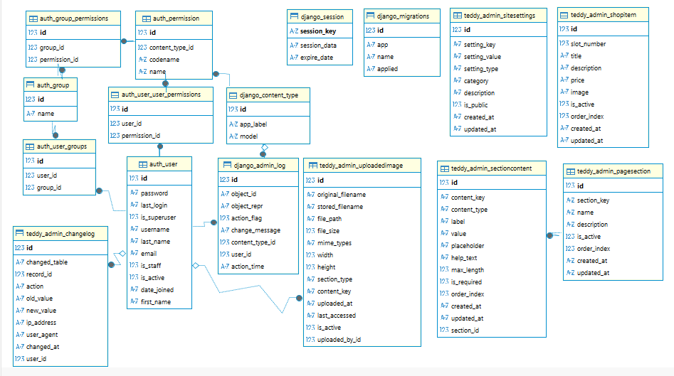

# Teddy's Tale — Django-проект сайта авторских мишек Тедди

> Полнофункциональный сайт для мастера ручной работы, реализованный на **Django 5.2+** с двойной системой администрирования.

---

## Общее описание проекта

**Teddy's Tale** — это веб-платформа, сочетающая публичную часть (лендинг для клиентов) и **двойную административную панель** для управления контентом. Сайт создан для мастера, изготавливающего авторских мишек Тедди вручную, и позволяет легко обновлять тексты, изображения, товары и настройки без вмешательства в код.
### Ключевые особенности
- **Двойная система администрирования** (стандартная Django + кастомная AJAX-панель)
- **Полностью динамический контент** с резервным режимом
- **Подробное аудит-логирование** всех изменений
- **Двухнедельные сессии** для удобства администраторов
- **Профессиональное логирование** с ротацией файлов
---

## Техническая реализация
### Архитектура проекта

---
``` 
TeddysTale/          # Проект Django 5.2
├── landing/                      # Приложение для лендинга
│   ├── migrations/               # Миграции базы данных
│   │   └── __init__.py
│   ├── templates/                # Шаблоны приложения landing
│   │   ├── index.html            # Главная страница сайта
│   │   └── privacy.html          # Страница политики конфиденциальности
│   ├── __init__.py               # Инициализация приложения
│   ├── admin.py                  # Регистрация моделей в админ-панели
│   ├── apps.py                   # Конфигурация приложения
│   ├── models.py                 # Модели данных приложения
│   ├── tests.py                  # Тесты приложения
│   ├── urls.py                   # URL-маршруты приложения
│   └── views.py                  # Основные представления
├── media/                        # Директория для загружаемых пользователями файлов
├── static/                       # Статические файлы
│   │   │ └── assets/
│   │   │     │   ├── fonts/                # Шрифты
│   │   │     │   │   ├── Lora/             # Шрифт Lora
│   │   │     │   │   │   ├── Lora.woff
│   │   │     │   │   │   ├── Lora.woff2
│   │   │     │   │   │   ├── Lora-Italic.woff
│   │   │     │   │   │   └── Lora-Italic.woff2
│   │   │     │   │   └── Montserrat/       # Шрифт Montserrat
│   │   │     │   │       ├── Montserrat-Italic-VariableFont_wght.woff
│   │   │     │   │       ├── Montserrat-Italic-VariableFont_wght.woff2
│   │   │     │   │       ├── Montserrat-VariableFont_wght.woff
│   │   │     │   │       └── Montserrat-VariableFont_wght.woff2
│   │   │     │   └──── icon/
│   │   │     │         ├── address.svg
│   │   │     │         ├── city.svg
│   │   │     │         ├── email.svg                # Иконка email
│   │   │     │         ├── enter_Admin-Panel.svg    # Иконка входа в админку
│   │   │     │         ├── favicon.svg              # Иконка фавикон
│   │   │     │         ├── out_Admin-Panel.svg      # Иконка выхода из админки
│   │   │     │         ├── phone.svg                # Иконка телефона
│   │   │     │         ├── teedy-logo.svg           # Логотип проекта
│   │   │     │         ├── Telegramm.svg            # Иконка Telegram
│   │   │     │         ├── VK.svg                   # Иконка VK
│   │   │     │         └── WhatsApp.svg             # Иконка WhatsApp
│   │   │     └── image/                       #Изображения
│   │   │         ├── Avatar.webp              # Аватар пользователя
│   │   │         ├── Hero_pic.webp            # Герой-изображение (заставка)
│   │   │         ├── shema.png                # Резервная карта
│   │   │         ├── Teddy_Buka.webp          # Изображение игрушки "Бука"
│   │   │         ├── Teddy.Caramelka.webp     # Изображение игрушки "Карамелька"
│   │   │         ├── Teddy_Graf.webp          # Изображение игрушки "Граф"
│   │   │         ├── Teddy.Karapuz.webp       # Изображение игрушки "Карапуз"
│   │   │         ├── Teddy_Luchik.webp        # Изображение игрушки "Лучик"
│   │   │         ├── Teddy_Maiki.webp         # Изображение игрушки "Майки"
│   │   │         ├── Teddy_Malishka.webp      # Изображение игрушки "Малышка"
│   │   │         ├── Teddy_Pushok.webp        # Изображение игрушки "Пушок"
│   │   │         └── Teddy_Umka.webp          # Изображение игрушки "Умка"
│   │   └── css/
│   │       ├── admin-panel.css          # Стили админ-панели
│   │       ├── enter-admin-panel.css    # Стили страницы входа в админку
│   │       ├── privacy.css              # Стили страницы политики конфиденциальности
│   │       └── style.css                # Основные стили сайта
│   └── js/
│       ├── admin-panel.js           # Логика админ-панели
│       ├── bubbles-animation.js     # Анимация пузырьков
│       ├── burger-menu.js           # Управление бургер-меню
│       ├── map.js                   # Работа с картой
│       └── scroll.js                # Логика скролла
├── teddy_admin/                   # Приложение для администрирования
│   ├── migrations/
│   │   ├── 0001_initial.py        # Начальная миграция моделей
│   │   └── __init__.py            # Исполняемый файл миграций
│   ├── templates/
│   │   ├── admin-panel.html       # Шаблон админ-панели
│   │   └── enter-admin-panel.html # Шаблон входа в админку
│   ├── __init__.py                # Исполняемый файл кастомной админ-панели
│   ├── admin.py                   # Кастомизация админ-панели
│   ├── apps.py                    # Конфигурация приложения
│   ├── decorators_custom.py       # Пользовательские декораторы
│   ├── models.py                  # Модели данных приложения
│   ├── permissions_custom.py      # Кастомные права доступа  
│   ├── signals.py                 # Django-сигналы
│   ├── tests.py                   # Тесты
│   ├── urls.py                    # URL-маршруты
│   ├── urls_custom.py             # Дополнительные URL
│   ├── views.py                   # Основные представления
│   └── views_custom.py            # Кастомные представления
├── TeddyTale/                   # Основной проект Django
│   ├── __init__.py              # Инициализация пакета Python
│   ├── asgi.py                  # ASGI-конфигурация для асинхронных серверов
│   ├── settings.py              # Основные настройки проекта
│   ├── urls.py                  # Корневые URL-маршруты проекта
│   ├── wsgi.py                  # WSGI-конфигурация для развертывания
├── templates/               # Глобальные шаблоны проекта
│   ├── base.html                # Базовый шаблон для наследования
│   └── includes/
│       ├── ellipses_big.html    # Декоративные элементы (большие эллипсы)
│       ├── ellipses_middle.html # Декоративные элементы (средние эллипсы)
│       ├── ellipses_small.html  # Декоративные элементы (маленькие эллипсы)
│       ├── footer.html          # Подвал основной части сайта
│       ├── footer_admin.html    # Подвал админ-панели
│       ├── header.html          # Шапка для основной части сайта
│       ├── header_admin.html    # Шапка для админ-панели
│       └── waves.html               # Элемент с волнами (декор)
├── db.sqlite3                   # Файл базы данных SQLite
├── manage.py                    # Точка входа для управления Django-проектом

┌── shema_db.png                 # Схема таблиц Базы Данных
├── README.md                    # Описание проекта
└── requirements.txt             # Зависимости Python
```
---

### Двойная система администрирования

| Тип админки | URL | Особенности | Назначение |
|-------------|-----|-------------|------------|
| **Стандартная Django + Jazzmin** | `/panel/` | Полный CRUD, все модели, расширенный интерфейс | Полное управление всеми данными |
| **Кастомная AJAX-панель** | `/admin-custom/panel/` | Быстрое редактирование, AJAX, фокус на основных элементах | Повседневное редактирование контента |

### Доступ к админ-панелям:
1. **Кастомный вход**: `/admin-custom/enter/` → `/admin-custom/panel/`
2. **Стандартный вход**: `/panel/` (стандартная Django авторизация)
3. **Совместимость**: Старая ссылка `/enter-admin-panel/` перенаправляет на кастомную админку

---

## Основные характеристики

| Компонент | Описание | Технологии/Инструменты |
|-----------|----------|-----------------------|
| **Фронтенд** | Адаптивный дизайн с поддержкой мобильных устройств | HTML5, CSS3, JavaScript, Яндекс.Карты |
| **Бэкенд** | Многоуровневое Django-приложение | Django 5.2.8, Python 3.8+ |
| **База данных** | Реляционная СУБД с миграциями | SQLite (разработка) / PostgreSQL (готово к продакшену) |
| **Аутентификация** | Двухфакторная система доступа | Django Auth, кастомные сессии, CSRF защита |
| **Управление контентом** | Полностью динамическое через две админ-панели | Модели Django, AJAX |
| **Файловый менеджер** | Загрузка, валидация и управление изображениями | django-cleanup, Pillow, валидация MIME-типов |
| **Логирование** | Детальное аудит-логирование с ротацией | RotatingFileHandler, структурированные логи |
| **Безопасность** | Многоуровневая защита | CSRF, XSS защита, безопасные cookies |

---

### 1. Модели данных (`models.py`)
Созданы следующие модели с расширенной функциональностью:

| Модель | Описание | Ключевые поля |
|--------|----------|---------------|
| **`PageSection`** | Управление секциями сайта | `section_key`, `name`, `order_index`, `is_active` |
| **`SectionContent`** | Гибкое хранение контента | `content_key`, `value`, `content_type` (текст/изображение/URL/координаты) |
| **`ShopItem`** | Товары с 1–9 слотами | `title`, `description`, `price`, `image`, `slot_number` |
| **`UploadedImage`** | Управление загруженными изображениями | `original_filename`, `stored_filename`, `file_path`, `section_type` |
| **`SiteSettings`** | Глобальные настройки сайта | `setting_key`, `setting_value`, `category`, `description` |
| **`ChangeLog`** | Журнал изменений с аудитом | `user`, `changed_table`, `action`, `old_value`, `new_value`, `ip_address` |

### 2. Двойная административная система
#### А) Стандартная админка Django с Jazzmin (`/panel/`)
- **Интерфейс**: Стилизованный с помощью `django-jazzmin`
- **Возможности**:
   - Полный CRUD для всех моделей
   - Иконки для быстрой навигации
   - Сортировка и фильтрация
   - Просмотр истории изменений
   - Управление пользователями и правами
- **Настройки**: Кастомизированная боковая панель, цветовая схема

#### Б) Кастомная AJAX-админка (`/admin-custom/panel/`)
- **Технология**: AJAX, JSON API, минималистичный интерфейс
- **Возможности**:
   - Редактирование без перезагрузки страницы
   - Быстрая загрузка изображений с предпросмотром
   - Валидация данных в реальном времени
   - Специализированные формы для каждой секции
   - История изменений в реальном времени

### 3. AJAX-эндпоинты кастомной админки

```python
# Основные AJAX-эндпоинты для быстрого редактирования:
update-shop-item/<int:item_id>/      # Обновление товара
update-section/<str:section_key>/    # Обновление секции
upload-image/                        # Загрузка изображений для секций
upload-shop-item-image/<int:item_id>/ # Загрузка изображений товаров
update-site-settings/                # Обновление глобальных настроек
```
---

### 4. Система безопасности
   - CSRF защита: Кастомные cookie и валидация токенов
   - Сессии: Двухнедельные сессии с автоматическим продлением
   - XSS защита: Встроенные фильтры Django + кастомные валидации
   - Валидация файлов: Проверка MIME-типов, размеров, расширений
   - Аудит доступа: Логирование всех входов и действий

### 5. Профессиональное логирование
**Система логирования с ротацией файлов и разделением по уровням:**
   - logs/django.log - Общие логи Django
   - logs/landing.log - Детальные логи публичной части
   - logs/errors.log - Только ошибки и критические ситуации
---
### Архитектура базы данных


---

### Используемые технологии (Django)
- **Models**: `CharField`, `TextField`, `ImageField`, `ForeignKey`, валидация
- **Views**: CBV (админка), FBV (публичная часть)
- **Forms**: `ModelForm` + кастомные формы
- **Templates**: наследование, динамические блоки
- **Middleware**: обработка запросов/ответов
- **Settings**: отдельные конфигурации для dev и prod

### База данных
- **Разработка**: SQLite3
- **Продакшен**: PostgreSQL (готово к развёртыванию)
- **Миграции**: автоматизированы через `makemigrations` / `migrate`

---

## Установка и запуск

1. Клонируйте репозиторий:

   <span style="color: red;">_git clone https://github.com/fesik-evgenya/TeddysTale_with-BackEnd.git_</span>

   <span style="color: red;">_cd teddys_tale_</span>
2. Установите зависимости:

   <span style="color: red;">_pip install -r requirements.txt_</span>

3. Примените миграции:

   <span style="color: red;">_python manage.py migrate_</span>

4. Создайте суперпользователя:

   <span style="color: red;">_python manage.py createsuperuser_</span>

5. Запустите сервер:

   <span style="color: red;">_python manage.py runserver_</span>

<span style="color: red;">Стандартная админ-панель будет доступна по адресу: http://127.0.0.1:8000/panel/</span>.
<span style="color: red;">Кастомная AJAX-админка будет доступна по адресу: http://127.0.0.1:8000/admin-custom/enter/</span>.

### Контакты
Проект разработан для мастера авторских мишек Тедди.
По вопросам настройки и доработки обращайтесь к разработчику: 
<span style="color: green;">ganef85@mail.ru</span>

### Версия и статус
Версия: 2.1 
Статус: __В разработке__